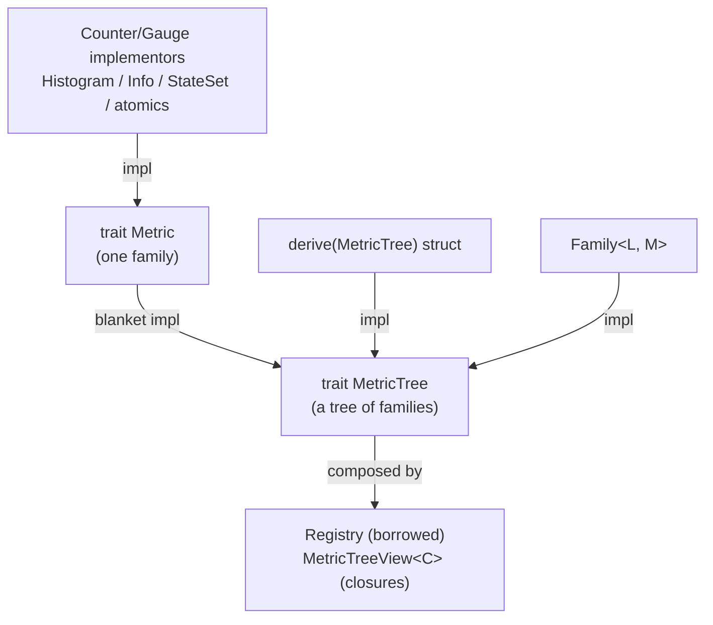

# Core model

This page names the concrete types and how they fit together. It is the map.
Later pages are the territory.

## Three layers

1. **Metric state:** counters, gauges, histograms, info, families.
2. **Composition:** `MetricTree`, `Registry`, and `MetricTreeView`.
3. **Instrumentation:** metrics derived from the `tracing` spans your code
   already emits (`metered-tracing`), or your own code updating the state
   directly.

Core `metered` is layers 1 and 2. It does not decide where service operations
begin or how you categorize errors.

The layers are deliberately independent. You can expose state that Metered
never "recorded," for example an existing atomic or a queue length.
Instrumentation can update metric state without owning exposition.

```text
instrumentation               metric state              composition / exposition
---------------               ------------              -----------------------
tracing spans      ------->   counter/gauge values      Metric  (one family)
direct updates                Histogram / Family ---->  MetricTree (families)
(your code)                   Info / StateSet           Registry / MetricTreeView
                                                        MetricSchema + MetricValues
                                                        -> OpenMetrics text
```

## Instrumentation: spans and direct updates

If code already runs inside `tracing` spans, `metered-tracing` exports span
counters and duration histograms as metric state. Instrument a method once, and
its performance shows up in both traces and metrics. There is no second call
site to maintain. The span guard closes the span exactly once: on a normal
return, a panic, or an `async` cancellation. The derived metrics never leak
an observation.

Everywhere else, your code is the instrumentation, and it updates owned state.
Increment a counter when the event happens. Set a gauge when the value changes.
Time an operation with `BucketHistogram::observe_duration`. There is no
measuring wrapper layer between your code and the metric.

## Leaves: `Metric`

A [`Metric`] is one OpenMetrics family. It states its `metric_type()` and knows
how to `collect_metric(...)` its current samples. Coupling the two in one trait
means a metric's declared type and its emitted values cannot disagree.

The stock leaf categories:

| API | OpenMetrics type | Role |
| --- | --- | --- |
| `Counter` implementors such as `AtomicU64` | counter | a monotonic count you own |
| `Gauge` implementors such as `AtomicI64` / `AtomicU64` | gauge | a current value you own |
| `BucketHistogram` | histogram | a distribution with classic `le` buckets |
| `Info` | info | static key/value facts |
| `StateSet` | `stateset` | one-of-N lifecycle state |

Standard-library atomics implement the relevant metric traits or `Metric`, so
you can expose existing state directly.

## Trees: `MetricTree`

A [`MetricTree`] is anything made of families. It can `describe` its schema and
`collect` its values. The default text rendering combines the two.
Leaves are trees automatically, through a blanket `impl`. You get a `MetricTree` from:

- `#[derive(MetricTree)]` -- a struct of metrics;
- `Family<L, M>` -- one metric per label set;
- a hand-written `impl` for a custom composite.

How the traits and types relate:



A leaf implements `Metric`. Everything else implements `MetricTree` directly. A
`Registry` or `MetricTreeView` composes trees under a prefix and constant labels.

## The upkeep path: `housekeep`

`MetricTree` carries a third pair of methods: `needs_housekeep` and
`housekeep`. This is the seam for maintenance that must not run on the
recording path: work that takes a lock, allocates, or rebuilds internal state.
The `DynamicExponentialHistogram` downscale and its straggler drain live here.
So does an interval-histogram swap behind `with_housekeep`.

The scrape pipeline drives it, not your code. `MetricTree::encode` runs
`housekeep` first when `needs_housekeep` reports pending work. A `Registry`
scrape does the same by default. `metered_om::SnapshotCache` drives it on its
own refresh cycle.

The result is one simple contract. The observe path of
every shipped instrument stays lock-free. Everything that is not lock-free
waits for the upkeep pass, which runs once per scrape on the scraping task.

Hand-written `MetricTree` implementations that contain histograms must
forward `housekeep` and `needs_housekeep` to their fields. A tree that
forgets freezes its dynamic histograms at their saturation point. The derive
forwards automatically.

## Composing for a scrape: `Registry` and `MetricTreeView`

Both turn a set of trees into one OpenMetrics document under a shared prefix and
constant labels. They differ in ownership:

- **`Registry`** is a borrowed view: you hand it `&` references for the duration
  of one encode. Good for one-off snapshots and for `adapter` metrics.
- **`MetricTreeView<C>`** stores *selector closures* over an app context
  `C` and borrows the live metrics at scrape time. Build it once, reuse it every
  scrape, with no shared ownership. This is the recommended service pattern.

## Schema versus values

A `MetricSchema` is the static contract -- family names, types, `HELP`, `UNIT`,
label names. `MetricValues` is the sampled state at one instant. A `MetricSink`
turns that pair into a wire format: the `metered-om` crate's
`OpenMetricsEncoder` renders text, and `OpenMetricsRender` does the same
incrementally. The core crate has no encoder of its own, so a service picks or
writes the sink it needs. Because the schema is independent of any scrape, it
also feeds documentation and [dashboards](./schema-dashboards.md).

## Choosing what to hold

A quick guide, expanded in [Choosing Metric Types](./metric-types.md):

| Need | Reach for |
| --- | --- |
| Count events | a `Counter` implementor such as `AtomicU64` |
| Current value you own | a `Gauge` implementor such as `AtomicI64` / `AtomicU64` |
| Current value something else owns | expose that state directly |
| A distribution / latency | `BucketHistogram` or `DynamicExponentialHistogram` |
| One-of-N state | `StateSet` |
| Static facts | `Info` |
| A bounded extra dimension | `Family<L, M>` |

Counters and histograms are cumulative. Gauges and state sets are
source-of-truth values. There is deliberately no generic "reset" -- it would be meaningless for
some of these and wrong for the rest.
