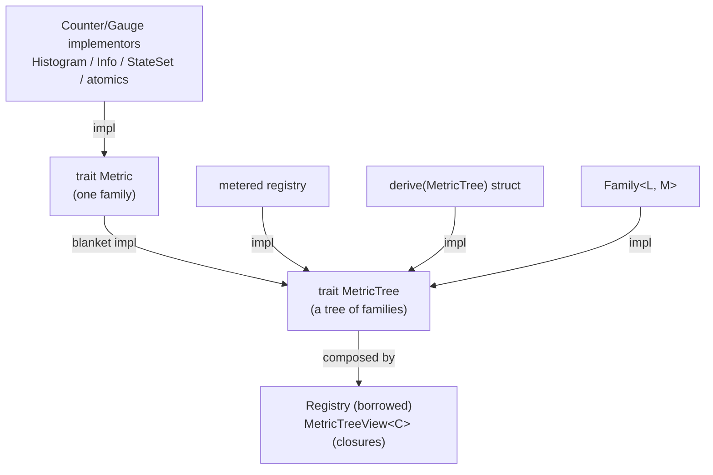

# Core Model

This chapter names the concrete types and how they fit together. It is the map;
later chapters are the territory.

## Three Layers

1. **Metric state:** counters, gauges, histograms, info, families.
2. **Composition:** `MetricTree`, `Registry`, and `MetricTreeView`.
3. **Instrumentation:** `metered-tracing`, optional `recording`, or legacy
   method wrappers.

Core `metered` is layers 1 and 2. It does not decide where service operations
begin or how errors should be categorized.

The layers are deliberately independent: you can expose state that was never
"recorded" through Metered at all (an existing atomic, a queue length), and
instrumentation can update metric state without owning exposition.

```text
instrumentation               metric state              composition / exposition
---------------               ------------              -----------------------
tracing spans      ------->   counter/gauge values      Metric  (one family)
recording::Operation          Histogram / Family ---->  MetricTree (families)
legacy wrappers               Info / StateSet           Registry / MetricTreeView
                                                        MetricSchema + MetricValues
                                                        -> OpenMetrics text
```

## Instrumentation: spans, recording, and legacy wrappers

For RPC/HTTP services, prefer `metered-tracing`: middleware creates spans for
operation boundaries and records bounded semantic attributes, then
`metered-tracing` exports span counters and duration histograms as metric state.

For explicit operation measurement where tracing is not available or not the
right boundary, enable the `metered-semantic` `recording` feature and use
`metered_semantic::recording::Operation`.

The method-level model lives in the `metered-semantic` crate. In that
model, a type that can measure an expression implements
[`Measure`](https://docs.rs/metered). Measuring is two steps:

1. `Measure::enter` runs *before* the expression and returns an owned
   `Recorder`. (`InFlight` increments here; `Elapsed` starts its clock.)
2. The recorder is held *across* the expression and finishes exactly once:
   `Recorder::complete` on a normal return, or its `Drop` on panic / early return
   / async cancellation.

Crucially the recorder owns its own handle, so nothing borrows your metric (or
`self`) while the body runs. That is what makes `&mut self` and `.await` bodies
work. You rarely call this by hand -- `measure!` and `#[metered]` generate it --
but it is the backbone of [Measuring Code](./measuring-code.md).

## Leaves: `Metric`

A [`Metric`] is one OpenMetrics family. It states its `metric_type()` and knows
how to `collect_metric(...)` its current samples. Coupling the two in one trait
means a metric's declared type and its emitted values cannot disagree.

The stock leaf categories:

| API | OpenMetrics type | Role |
| --- | --- | --- |
| `Counter` implementors such as `AtomicU64` | counter | a monotonic count you own |
| `Gauge` implementors such as `AtomicI64` / `AtomicU64` | gauge | a current value you own |
| `BucketHistogram` | histogram | a distribution (classic `le` buckets) |
| `Info` | info | static key/value facts |
| `StateSet` | stateset | one-of-N lifecycle state |

With the `legacy` feature, semantic wrappers are thin newtypes over those leaves,
named for method-level compatibility:

| Wrapper | Wraps | Use for |
| --- | --- | --- |
| `HitCount` | `Counter` | attempts / entries |
| `ErrorCount` | `Counter` | `Err` results |
| `NoneCount` | `Counter` | `None` results |
| `InFlight` | `Gauge` | active work |
| `Elapsed` | `BucketHistogram` | durations (seconds) |

Standard-library atomics implement the relevant metric traits or `Metric`, so
existing state is exposable directly.

## Trees: `MetricTree`

A [`MetricTree`] is anything made of families. It can `describe` its schema and
`collect` its values; rendering to text is the default combination of the two.
Leaves are trees automatically (a blanket impl). You get a `MetricTree` from:

- `#[derive(MetricTree)]` -- a struct of metrics;
- `Family<L, M>` -- one metric per label set;
- `metered_semantic::recording::Operation` -- explicit non-tracing operation
  metrics behind the `metered-semantic` `recording` feature;
- `#[metered]` -- a generated per-method registry in the `metered-semantic` crate;
- a hand-written `impl` for a custom composite.

How the traits and types relate:



A leaf implements `Metric`; everything else implements `MetricTree` directly. A
`Registry` or `MetricTreeView` composes trees under a prefix and constant labels.

## Composing for a scrape: `Registry` and `MetricTreeView`

Both turn a set of trees into one OpenMetrics document under a shared prefix and
constant labels. They differ in ownership:

- **`Registry`** is a borrowed view: you hand it `&` references for the duration
  of one encode. Good for one-off snapshots and for `adapter` metrics.
- **`MetricTreeView<C>`** stores *selector closures* over an application context
  `C` and borrows the live metrics at scrape time. Build it once, reuse it every
  scrape, with no shared ownership. This is the recommended service pattern.

## Schema vs values

A `MetricSchema` is the static contract -- family names, types, HELP, UNIT, label
names. `MetricValues` is the sampled state at one instant. A `MetricSink` turns
that pair into a wire format: the `metered-om` crate's
`OpenMetricsEncoder` renders text, and `OpenMetricsRender` does the same
incrementally. The core crate has no encoder of its own, so a service picks (or
writes) the sink it needs. Because the schema is independent of any scrape, it
also feeds documentation and [dashboards](./schema-dashboards.md).

## Choosing what to hold

A quick guide (expanded in [Choosing Metric Types](./metric-types.md)):

| Need | Reach for |
| --- | --- |
| Count events | a `Counter` implementor such as `AtomicU64` (or legacy `HitCount` / `ErrorCount`) |
| Current value you own | a `Gauge` implementor such as `AtomicI64` / `AtomicU64` (or legacy `InFlight`) |
| Current value something else owns | expose that state directly |
| A distribution / latency | `BucketHistogram`, `DynamicExponentialHistogram`, or legacy `Elapsed` |
| One-of-N state | `StateSet` |
| Static facts | `Info` |
| A bounded extra dimension | `Family<L, M>` |

Counters and histograms are cumulative; gauges and state sets are source-of-truth
values. There is deliberately no generic "reset" -- it would be meaningless for
some of these and wrong for the rest.
