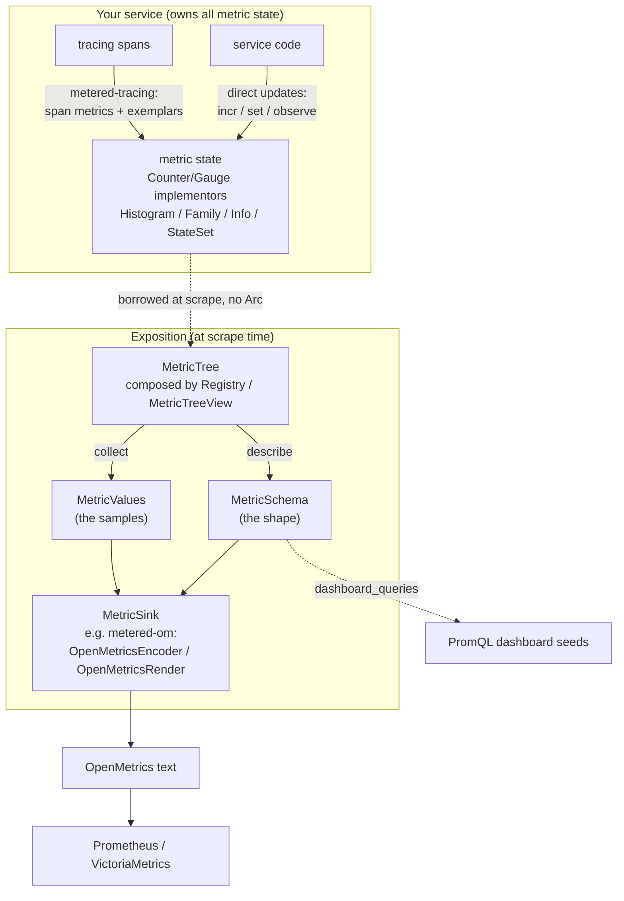

# Why Metered has this design

Metered makes a handful of strong, opinionated choices. Each one follows from the
mental model in the [primer](./metrics-primer.md): a metric is *state you
expose*, pull-based and cumulative. This page explains the choices, because
understanding them makes the API feel obvious.

## Architecture at a glance

Three independent concerns meet at the metric state your service owns:

1. **Metric state** is readable service state: counters, gauges, histograms,
   info, state sets, and families.
2. **Composition** describes how to borrow that state at scrape time through
   `MetricTree`, `Registry`, and `MetricTreeView`.
3. **Instrumentation** updates state from tracing spans, or directly from the
   code that owns it.

Core `metered` owns the first two concerns. It does not decide where service
operations begin or how you categorize errors.

The rest of this page is *why* each of those pieces looks the way it does.

## Metrics are state, not a shadow system

The central idea: **a metric is a piece of your service's state**, owned by the
component whose behavior it describes. A queue's depth metric *is* the queue's
length. A pool's "in use" gauge *is* the pool's checked-out count.

So Metered has **no global registry and no statics**. You do not "register a
metric with the metrics system" and then find it again by string name. You hold
concrete metric state, for example an `AtomicU64` counter or a histogram, as a
field, exactly where the relevant state lives. You expose it at scrape time.
This means:

- No name-based lookups, no typos resolved at runtime, no init ordering.
- No accidental sharing: two subsystems cannot clobber each other's metric by
  using the same global name.
- The borrow checker keeps instrumentation honest -- a metric cannot outlive the
  thing it measures.

A consequence you notice in practice: **prefer exposing existing state over
maintaining a parallel counter.** If the queue knows its length, read the
queue. Do not increment a separate gauge on every push and pop and hope it
never drifts.

## No `Arc`, even across `.await`

Instrumentation must not force you to wrap your service in `Arc`, and must work
in `async` code where the body holds `&mut self` across an `.await`.

Direct updates satisfy this trivially. `incr`, `set`, and `observe` take
`&self` through interior mutability. They borrow the metric only for the
instant of the update, never across the measured body. Span-derived measurement
satisfies it structurally. The `metered-tracing` layer records the duration
when the span closes. Nothing borrows your service, or `self`, while the
operation runs.

For exposition, the same principle drives `MetricTreeView`: it stores *selector
closures*, not metric references, and borrows the live service at scrape time. No
`Arc` on every metric, no shared ownership just to encode text.

## Record exactly once -- even on panic or cancellation

Span-derived metrics inherit `tracing`'s guard semantics. The guard closes a
span exactly once: on a normal return, a panic, an early `return`, or an
`async` task cancellation. `metered-tracing` records on close. So span counters and
duration histograms do not leak in-flight state or lose observations when the
body exits abnormally.

## OpenMetrics-native, no `serde` on the default path

Metered writes the OpenMetrics text format directly. It does not serialize
metrics to a generic data model and then map field names to Prometheus
conventions.

Why it matters:

- **Fidelity.** Counter `_total` suffixes, histogram `_bucket`/`_sum`/`_count`,
  `# TYPE`/`# HELP`/`# UNIT` metadata, exemplars, and `stateset` semantics are
  first-class, not approximated by reshaping JSON.
- **Dependency hygiene.** The default public API of `metered` has no foreign
  types, so a `metered` upgrade never forces a `serde` or `hdrhistogram` bump on
  your workspace. See [Feature flags and stability](./features.md).

## Cumulative histograms over in-process summaries

Older metrics libraries and pre-computed HDR summaries compute
quantiles in your process and expose them as a summary. The problem is
aggregation: you cannot combine two replicas' pre-computed p95s into a fleet p95.

Metered's operation duration paths -- `metered-tracing` span durations and
direct `observe_duration` calls -- record into cumulative bucket **histograms**.
The query
engine computes percentiles at query time with `histogram_quantile`, where they
aggregate across replicas correctly. The bucket counters are also lock-free, so the hot path never
blocks.

## A lock-free, allocation-free hot path

Stock metrics back their state with atomics allocated once at construction. The
recording path -- `incr`, `observe`, gauge `set` -- is a relaxed atomic operation
with no allocation and no mutex. Per-bucket exemplars are lock-free too. Each
bucket has its own swap slot, off the counting path. The slot changes only when
your code supplies an exemplar.

The cost guidance follows. A plain counter is
the cheap metric for the hottest paths. Duration histograms are the richer
metrics you reserve for entry points.

## Schema, values, and rendering are separate

Every metric tree can do two independent things: **describe** its schema --
family names, types, units, label names -- and **collect** its current values. The
renderer combines a schema and a value set into OpenMetrics text.

This split buys a lot:

- The schema can drive documentation and dashboard generation without a live
  scrape ([Schema and Dashboards](./schema-dashboards.md)).
- The encoder can emit values incrementally, with a budget, for very large
  metric sets ([OpenMetrics Exposition](./openmetrics.md)).
- Because a single `MetricTree::encode` is *defined* as
  `describe + collect + render`, a tree can never advertise one shape in its
  schema and emit another in
  its samples. The consistency is structural, not a convention.

## A type for the leaf, a trait for the tree

Two traits, with one job each:

- **`Metric`**: a single OpenMetrics family implements it (a `Counter`
  implementor, a `Gauge` implementor, a histogram). It couples the family's
  *type* and its *value collection* in one place, so they cannot drift.
- **`MetricTree`**: anything composed of families implements it, such as a
  `#[derive(MetricTree)]` struct or a `Family`. Leaves get it for free
  via a blanket implementation.

You implement `Metric` for a new leaf. You usually derive `MetricTree` for a
composite. That is the whole extension story.

## Evolvable on purpose

Metered expects to reach 1.0 without churning its callers:

- Open enums like `MetricType` are `#[non_exhaustive]`, so new OpenMetrics
  constructs can land without breaking `match`es.
- The macros emit `::metered::` absolute paths, so generated code is immune to
  local name shadowing.
- The procedural and derive macros are re-exported from `metered`, so downstream
  crates depend on `metered` alone and the two halves always move together.

With the "why" in hand, the [Core model](./core-model.md) introduces the concrete
types.
