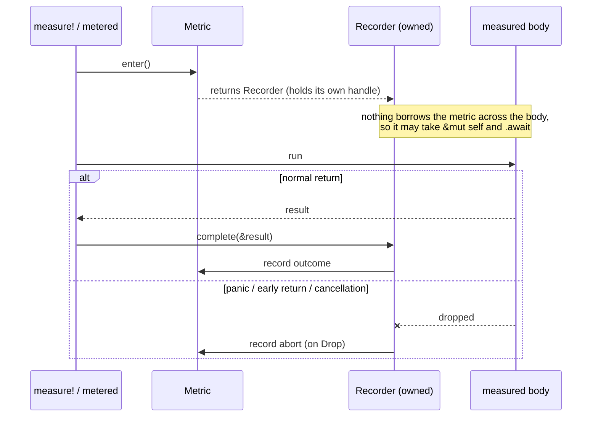

# Measuring Code

This chapter covers the method-measurement API. It lives in the
`metered-semantic` crate; add it alongside `metered` to use these wrappers and
macros.

For new service RPC/HTTP/server operation metrics, prefer spans and
`metered-tracing`; middleware can set route, method, status, and error-class
attributes without coupling core metric state to service boundaries. For explicit
non-tracing operation measurement, use the `metered-semantic` `recording` feature
and `metered_semantic::recording::Operation`.

## `#[metered]`: per-method registries

Annotate an `impl` block, name a registry, and annotate methods with the metrics
you want. Metered generates the registry type and the recording boilerplate:

```rust
use metered_semantic::{metered, ErrorCount, HitCount, InFlight, Elapsed};

#[derive(Default)]
struct Api {
    metrics: ApiMetrics,
}

#[metered(registry = ApiMetrics)]
impl Api {
    #[measure([HitCount, ErrorCount, InFlight, Elapsed])]
    fn handle(&self) -> Result<(), &'static str> {
        Ok(())
    }
}
```

`ApiMetrics` is generated, derives `Default` and `Debug`, and implements
`MetricTree`, so the whole tree renders to OpenMetrics and describes its schema.
Metrics are organized hierarchically -- one sub-registry per measured method --
so access is constant-time and cache-friendly, with no overhead beyond the metric
itself.

A few knobs:

- The registry is reached as `self.metrics` by default. Override with
  `#[metered(registry = ApiMetrics, registry_expr = self.inner.metrics)]`.
- The generated registry's visibility defaults to `pub(crate)`; set
  `visibility = pub` to expose it across crates.
- Annotate a method with bare `#[measure]` to inherit the metric list given on
  the `impl` block.
- Use `#[metric(rename = "...")]` on a method so renaming it does not move its
  metrics (see [Shaping Names](./name-shaping.md)).

## `measure!`: manual composition

When manual control is clearer -- measuring an expression that is not a whole
method, or composing metrics by hand -- use `measure!`:

```rust
use metered_semantic::{measure, Elapsed};

let elapsed: Elapsed = Elapsed::default();
let value = measure!(&elapsed, {
    42
});
assert_eq!(value, 42);
assert_eq!(elapsed.snapshot().count, 1);
```

It takes a reference to a metric (or an array of references, which expands
recursively) and an expression, returns the expression's value unchanged, and
records around it. Nesting `measure!` calls is how `#[metered]` composes multiple
metrics over one body.

## Error breakdowns with `#[error_count]`

`ErrorCount` counts *all* `Err` results. To break them down per variant, derive a
breakdown from your error enum:

```rust
use metered_semantic::error_count;

#[error_count(name = ApiErrorCount, visibility = pub)]
#[derive(Debug)]
enum ApiError {
    Timeout,
    NotFound,
    Invalid,
}
# impl std::fmt::Display for ApiError {
#     fn fmt(&self, f: &mut std::fmt::Formatter<'_>) -> std::fmt::Result { write!(f, "err") }
# }
# impl std::error::Error for ApiError {}
```

Add `ApiErrorCount` to a method's `#[measure([...])]` list and each variant is
counted under an `error_kind` label on one counter family. Nested breakdowns are
supported via `#[nested]` on a variant field.

## Correctness: exactly once, even on failure



The recorder model (see [Core Model](./core-model.md)) records the outcome
exactly once:

- `complete` on a normal return -- the result is available, so `ErrorCount` can
  classify `Ok` vs `Err`;
- the recorder's `Drop` on a **panic**, an **early `return`**, or **async
  cancellation** -- recorded as an abort.

So an `InFlight` gauge that incremented on entry always decrements, and an
`Elapsed` always records, however the body exits. You do not write any of this;
it is the point of the two-phase model.

## Async and `&mut self`

Because the recorder owns its handle and nothing borrows the metric across the
body, a measured method may take `&mut self` and `.await`:

```rust
# use metered_semantic::{metered, Elapsed};
# #[derive(Default)]
# struct Worker { metrics: WorkerMetrics }
#[metered(registry = WorkerMetrics)]
impl Worker {
    #[measure(Elapsed)]
    async fn run(&mut self) {
        // ... .await freely; Elapsed records the wall-clock span,
        // including time suspended at await points ...
    }
}
# fn main() {}
```

Use lighter metrics (`HitCount`) on the very hottest paths and reserve richer
ones (`Elapsed`) for entry points where a duration histogram earns its keep.
