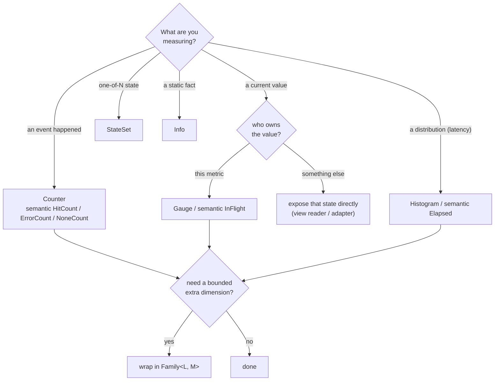

# Choosing Metric Types

Picking the right type is most of what makes metrics good. This chapter is a
decision guide plus a reference for each type Metered offers.

## The decision in one paragraph

Is it an **event** you count? Use a **counter**. Is it a **current value**? Use a
**gauge** -- and if something already owns that value, expose *that*, don't keep a
copy. Is it a **distribution** (especially latency)? Use a **histogram**. Is it
**one-of-N state**? Use a **stateset**. Is it a **static fact**? Use **info**.
Need an extra **bounded dimension**? Add a **`Family`**.

The same decision as a flowchart:



## All metric types at a glance

| OpenMetrics type | Instrument | Notes |
|---|---|---|
| `counter`        | `Counter` / `AtomicU64` | Monotonic; suffix `_total`. |
| `gauge`          | `Gauge` view *or* owned `Gauge`/`AtomicI64` field | Live pull vs cached accumulator — see Gauge below. |
| `histogram`      | `BucketHistogram`, `DynamicExponentialHistogram` | Aggregatable; prefer for latencies. |
| `summary`        | `Summary<S>` over a `QuantileSource` | Per-instance quantiles; **not** aggregatable. |
| `gaugehistogram` | `GaugeHistogram<S>` over a `GaugeHistogramSource` (`GaugeBuckets`) | Current-value buckets; `_gcount`/`_gsum`. |
| `stateset`       | `StateSet` | Mutually-exclusive boolean states. |
| `info`           | `InfoMetric` | Static metadata; value always `1`. |
| `unknown`        | passthrough samples | Foreign metrics of unknown semantics. |

## Counter

For values that only increase: requests, errors, retries, bytes, dropped
messages. `Counter` is the trait; `AtomicU64` is the usual concrete storage.

```rust
use metered::Counter;
use std::sync::atomic::AtomicU64;

let processed = AtomicU64::new(0);
processed.incr();
processed.incr_by(10);
assert_eq!(processed.get(), 11);
```

With the `metered-semantic` crate, semantic wrappers make intent obvious and are
recorded automatically by `measure!` / `#[metered]`:

- `HitCount` -- attempts or entries to a piece of code.
- `ErrorCount` -- `Err` results from a `Result`-returning expression.
- `NoneCount` -- `None` results from an `Option`-returning expression.

Do not name a counter field `*_total`: the encoding adds `_total`, so `requests`
becomes `requests_total` on the wire (a `requests_total` field becomes
`requests_total_total`).

## Gauge

For a current value that moves up and down: in-flight work, queue depth, pool
size, a flag. `Gauge` is the trait; standard atomics are the usual concrete
storage.

```rust
use metered::Gauge;
use std::sync::atomic::AtomicI64;

let in_flight = AtomicI64::new(0);
in_flight.incr();         // a request started
in_flight.decr();         // it finished
let flag = AtomicI64::new(0);
flag.set_enabled(true);   // 1 / 0
```

With the `metered-semantic` crate, `InFlight` is the semantic wrapper for "active work"; `measure!` increments it on
entry and decrements on exit (even on panic).

**Gauge vs counter** is the most common mistake. "Total requests", "failed
publishes", "retries", and "dropped messages" are *counters*, not gauges -- you
want their rate, not their instantaneous value. "In-flight requests", "queue
depth", "cache entries", and "enabled?" are gauges.

**Prefer existing state.** If a value is already owned elsewhere, expose it
rather than maintaining a parallel gauge that can drift -- see
[Adding Metrics](./adding-metrics.md) and the `queue` module in the demo.

**Live vs cached.** Both forms render as a plain `gauge` (OpenMetrics has no
`UpDownCounter` type). A *live gauge* — a view reader like
`gauge_value(|state| state.queue.len())` — is pulled fresh from your domain state
at every scrape (uncached, always truthful, but the read must be cheap). A *cached
accumulator* — an owned `Gauge`/`AtomicI64` you bump with `incr`/`decr` — reads
O(1) at scrape; reach for it when the value is cheap to maintain incrementally but
expensive or impossible to observe live. There is no per-metric value cache:
`metered-om`'s `SnapshotCache` bounds live-read cost at the document level.

## Histogram (and `Elapsed`)

For distributions -- almost always latency. `BucketHistogram` records raw values.
With the `metered-semantic` crate, `Elapsed` is the duration wrapper that times an expression and records seconds.
(`Histogram` is the trait abstracting over the bucket and exponential backends;
`BucketHistogram` is the classic `le`-bucket implementation.)

```rust
use metered::{BucketHistogram, Buckets};

// Choose buckets that bracket your expected range.
let sizes = BucketHistogram::new(Buckets::exponential(64.0, 2.0, 10));
sizes.observe(512.0);
```

Bucket presets (all in **seconds** for durations):

- `Buckets::seconds_default()` -- general request latencies (5ms .. 10s).
- `Buckets::fast_seconds()` -- sub-5ms services, down to 25µs.
- `Buckets::slow_seconds()` -- DB-heavy / batch work, out to a minute.
- `Buckets::wide_seconds()` -- fine near a microsecond, coarse near multi-second
  timeouts (1µs .. ~30s, ≤30% relative). For fast paths whose latency spans many
  orders of magnitude.
- `Buckets::relative(min, max, max_relative_error)` -- exponential buckets sized
  to a target relative resolution; you give the range and how coarse you tolerate
  and the count is solved for you.
- `Buckets::exponential(start, factor, n)` / `exponential_range(min, max, n)` --
  the explicit-count exponential builders.

### Wide dynamic range: fine low, coarse high

When you care about microsecond-scale fast paths but only need rough numbers near
timeouts, use **relative** resolution: a bucket near value `v` is about
`v * max_relative_error` wide, so the *absolute* resolution is fine at the bottom
and coarse at the top automatically.

```rust
use metered::{BucketHistogram, Buckets};

// <=10% relative from 1µs to 30s: ~0.1µs near the floor, ~1s near a 10s timeout.
let h = BucketHistogram::new(Buckets::relative(0.000_001, 30.0, 0.10));
```

Tighter error or a wider range means more buckets (each boundary is a stored `le`
series per label set), so it is a resolution-vs-cardinality dial: ~10% over 1µs..30s
is ~180 buckets, ~30% (`wide_seconds`) is ~70. There is no way to get fine
*absolute* resolution across the whole range cheaply -- 10µs linear buckets to 10s
would be a million series -- which is exactly why exponential relative-error
histogram designs exist.

Quantiles come from `histogram_quantile(...)` at query time, so they aggregate
across replicas. That is the whole reason to prefer a histogram over a summary.

### Exponential histograms

For wide dynamic ranges, Metered also provides log-linear exponential histogram
backends: `FixedExponentialHistogram` and `DynamicExponentialHistogram`. They
record sparse exponential bucket snapshots (`ExponentialSnapshot`) and can be
rendered by `metered-om` either as classic cumulative `le` buckets or as
VictoriaMetrics `vmrange` buckets.

This is separate from Prometheus native histogram protobuf exposition. If/when a
protobuf sink is worth adding, it can render from the same `MetricValues` model
without changing metric ownership or observation code.
With the `metered-semantic` crate, `Elapsed` can also attach
[exemplars](./exemplars.md) to buckets.

## Summary

A `Summary<S>` renders pre-computed quantiles (`name{quantile="0.99"}`) plus
`name_sum` and `name_count`, reading them from any `QuantileSource`. Its quantiles
are **per-instance and do not aggregate across replicas** — prefer a histogram
unless you specifically need exact per-instance quantiles or legacy dashboard
parity.

```rust
use metered::summary::BucketQuantiles;
use metered::{BucketHistogram, Buckets, Summary};

let latency = BucketHistogram::new(Buckets::seconds_default());
latency.observe(0.012);
// Any `Histogram` is a `QuantileSource` via `BucketQuantiles`.
let summary = Summary::new(BucketQuantiles::new(&latency));
```

`BucketQuantiles` adapts any `Histogram`; the `DynamicExponentialHistogram` is the
recommended source (lock-free `observe`, bounded memory, bounded relative error). A
bespoke streaming sketch (e.g. CKMS) is intentionally not provided — it cannot be
lock-free, does not beat the exponential histogram on memory, and only offers a
different (rank-error) accuracy model; if ever needed it drops in as a
`QuantileSource` impl behind the same seam.

## Gauge histogram

A `GaugeHistogram<S>` renders a *current* value distribution — buckets that may
**decrease** — as `name_bucket{le}` + `name_gcount` + `name_gsum`. Use it for a
live population's size distribution, not a cumulative count of events. Implement
`GaugeHistogramSource` for your own state, or use the provided `GaugeBuckets`:

```rust
use metered::{GaugeBuckets, GaugeHistogram};

let sizes = GaugeBuckets::new([1.0, 10.0, 100.0]);
sizes.enter(5.0); // an item of size 5 is now held
sizes.leave(5.0); // it was released
let gh = GaugeHistogram::new(sizes);
```

## StateSet

For mutually-exclusive state -- a lifecycle, a mode -- where exactly one member
is active:

```rust
use metered::StateSet;

let lifecycle = StateSet::new(["starting", "running", "draining"]);
lifecycle.set("running");
```

It emits one series per state, the active one `1` and the rest `0`, with the
state carried in a label named after the metric.

## Info

For static facts about the process -- version, commit, region -- as a constant
`1` carrying labels:

```rust
use metered::InfoMetric;

let build = InfoMetric::new([("version", "0.10.0"), ("commit", "abc123")]);
```

Use it to attach build context to dashboards by joining on `*_info`.

## Family: a bounded extra dimension

When one metric needs a label dimension -- per route, per method, per upstream --
wrap it in a `Family`. See [Labels and Families](./labels-families.md) for the
cardinality discipline that keeps this safe.

```rust
use metered::{Counter, Family};
use std::sync::atomic::AtomicU64;

let by_route: Family<Vec<(String, String)>, AtomicU64> =
    Family::with_label_names(["route"]);
by_route.with(&vec![("route".to_owned(), "/health".to_owned())], |c| c.incr());
```

## Unknown (passthrough)

`MetricType::Unknown` exists for passthrough or foreign metrics whose semantics aren't
known — it renders a plain sample with no suffix. You don't construct it directly;
it's used by passthrough sources that re-emit metrics from another system.

## Serving a foreign metrics endpoint (incl. metered 0.9)

`metered_om::TextSourceTree` re-emits any classic Prometheus/OpenMetrics
text as a `MetricTree`, so you can serve a foreign producer — a sidecar, another
exporter, or a metered 0.9 registry's `serde_prometheus` output — on a 0.10
`/metrics` endpoint during migration. Nothing about it is 0.9-specific; metered
0.9 is just one such producer (and the `metered-legacy` crate is gone — depend on
the published 0.9 crate to run 0.9 in-process).

```rust,ignore
use metered_om::TextSourceTree;
let legacy = TextSourceTree::new(|| old_0_9_registry.to_prometheus_text());
// mount `legacy` alongside your native 0.10 trees
```

Samples pass through byte-for-byte, so a 0.9 HDR summary stays a summary and
existing dashboards keep working. Once a metric is migrated to a native 0.10
instrument, drop it from the passthrough source.

## When none of these fit

Implement [`Metric`](./design.md) for a custom leaf (its type plus how it reads
its value) or `MetricTree` for a custom composite. This is rare; reach for it only
when you genuinely have a new OpenMetrics shape or an unusual source of truth.
