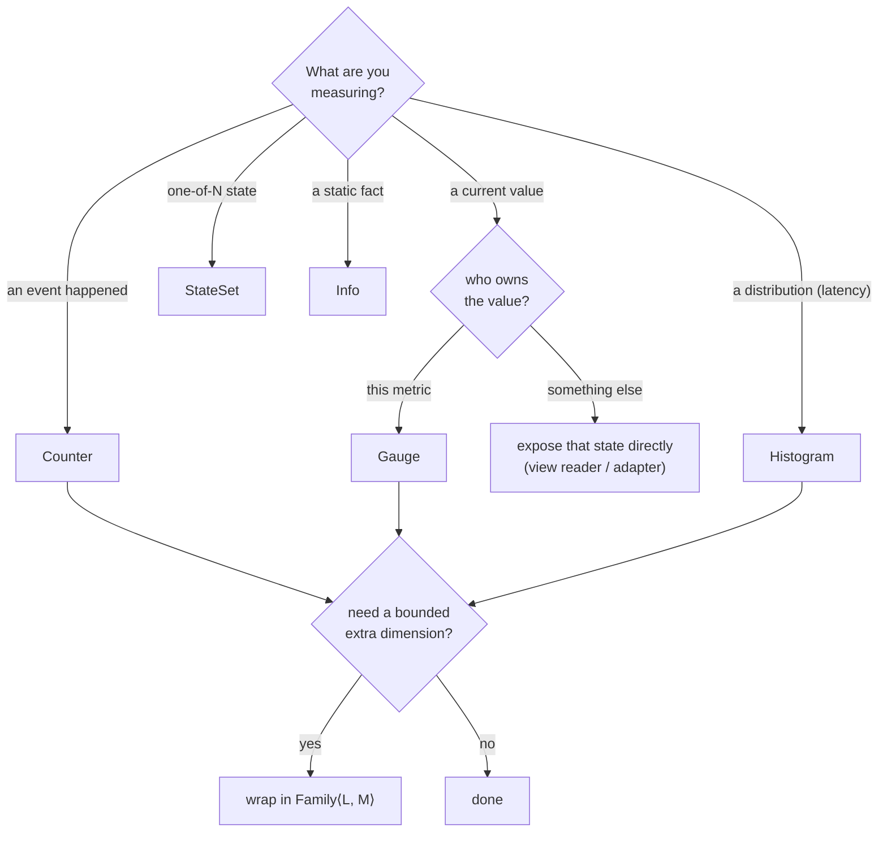

# Choosing metric types

Picking the right type is most of what makes metrics good. This page is a
decision guide plus a reference for each type Metered offers.

## The decision in one paragraph

For an **event** you count, use a **counter**. For a **current value**, use a
**gauge**, but if another component already owns that value, expose that value
instead of a copy. For a **distribution**, latency in particular, use a
**histogram**. For **one-of-N state**, use a **`StateSet`**. For a **static
fact**, use **info**. For an extra **bounded dimension**, add a **`Family`**.

The same decision as a flowchart:



## All metric types at a glance

| OpenMetrics type | Instrument | Notes |
|---|---|---|
| `counter`        | `Counter` / `AtomicU64` | Monotonic; suffix `_total`. |
| `gauge`          | `Gauge` view *or* owned `Gauge`/`AtomicI64` field | Live pull or cached accumulator. See Gauge below. |
| `histogram`      | `BucketHistogram`, `DynamicExponentialHistogram` | Aggregates across replicas; prefer for latencies. |
| `summary`        | `Summary<S>` over a `QuantileSource` | Per-instance quantile values; does **not** aggregate. |
| `gaugehistogram` | `GaugeHistogram<S>` over a `GaugeHistogramSource`, for example `GaugeBuckets` | Current-value buckets; `_gcount`/`_gsum`. |
| `stateset`       | `StateSet` | Mutually exclusive boolean states. |
| `info`           | `InfoMetric` | Static metadata; value always `1`. |
| `unknown`        | passthrough samples | Foreign metrics of unknown semantics. |

## Counter

For values that only increase: requests, errors, retries, bytes, dropped
messages. `Counter` is the trait. `AtomicU64` is the usual concrete storage.

```rust
use metered::Counter;
use std::sync::atomic::AtomicU64;

let processed = AtomicU64::new(0);
processed.incr();
processed.incr_by(10);
assert_eq!(processed.get(), 11);
```

Make intent obvious through the field name -- `attempts`, `failures`,
`cache_misses` -- or through a domain newtype over the counter. The storage is
the same `AtomicU64` either way.

Do not name a counter field `*_total`: the encoding adds `_total`, so `requests`
becomes `requests_total` on the wire (a `requests_total` field becomes
`requests_total_total`).

## Gauge

For a current value that moves up and down: in-flight work, queue depth, pool
size, a flag. `Gauge` is the trait. Standard atomics are the usual concrete
storage.

```rust
use std::sync::atomic::{AtomicI64, Ordering};

let in_flight = AtomicI64::new(0);
in_flight.fetch_add(1, Ordering::Relaxed); // a request started
in_flight.fetch_sub(1, Ordering::Relaxed); // it finished
let flag = AtomicI64::new(0);
flag.store(1, Ordering::Relaxed);          // 1 / 0
```

Your code updates plain atomics. The exposition side reads them through the
`Gauge` trait, which the standard atomics implement. The trait also has
`incr`/`decr`/`set` helpers if you prefer them, but nothing requires a metrics
call on the update path.

**Gauge vs counter** is the most common mistake. "Total requests," "failed
publishes," "retries," and "dropped messages" are *counters*, not gauges -- you
want their rate, not their instantaneous value. "In-flight requests," "queue
depth," "cache entries," and "enabled?" are gauges.

**Prefer existing state.** If another component already owns a value, expose
that value. Do not maintain a parallel gauge that can drift. See
[Adding Metrics](./adding-metrics.md) and the `queue` module in the demo.

**Live vs cached.** Both forms encode as a plain `gauge` because OpenMetrics has
no `UpDownCounter` type. A *live gauge* is a view reader like
`gauge_value("queue_depth").read(|state: &State| state.queue.len() as i64)`.
Each scrape reads it fresh from your domain state, with no cache, so it is
always truthful, but the read must be cheap.

A *cached accumulator* is an owned `Gauge`/`AtomicI64` you bump with
`incr`/`decr`. It reads `O(1)` at scrape. Use it when the value is cheap to
maintain incrementally but expensive or impossible to observe live. There is no
per-metric value cache: `metered-om`'s `SnapshotCache` bounds live-read cost at
the document level.

## Histogram

For distributions -- almost always latency. `BucketHistogram` records raw values
with `observe`. It records durations with `observe_duration`, which converts
them to seconds, the base unit. `Histogram` is the trait that abstracts over the
bucket and exponential backends. `BucketHistogram` is the classic `le`-bucket
implementation.

```rust
use metered::{BucketHistogram, Buckets};

// Choose buckets that bracket your expected range.
let sizes = BucketHistogram::new(Buckets::exponential(64.0, 2.0, 10));
sizes.observe(512.0);
```

Bucket presets, all in **seconds** for durations:

- `Buckets::seconds_default()` -- general request latencies, 5 ms to 10 s.
- `Buckets::fast_seconds()` -- services below 5 ms, down to 25 µs.
- `Buckets::slow_seconds()` -- DB-heavy / batch work, out to a minute.
- `Buckets::wide_seconds()` -- fine near a microsecond, coarse near multi-second
  timeouts: 1 µs to about 30 s, at most 30% relative error. For fast paths whose
  latency spans a very wide range.
- `Buckets::relative(min, max, max_relative_error)` -- exponential buckets sized
  to a target relative resolution. You give the range and the error you
  tolerate, and the builder solves for the count.
- `Buckets::exponential(start, factor, n)` / `exponential_range(min, max, n)` --
  the explicit-count exponential builders.

### Wide dynamic range: fine low, coarse high

When you care about microsecond-scale fast paths but only need rough numbers
near timeouts, use **relative** resolution. A bucket near value `v` is about
`v * max_relative_error` wide. The *absolute* resolution is then automatically
fine at the bottom and coarse at the top.

```rust
use metered::{BucketHistogram, Buckets};

// <=10% relative from 1µs to 30s: ~0.1µs near the floor, ~1s near a 10s timeout.
let h = BucketHistogram::new(Buckets::relative(0.000_001, 30.0, 0.10));
```

Tighter error or a wider range means more buckets. Each boundary is a stored
`le` series per label set, so this is a dial between resolution and cardinality.
About 10% error over 1 µs to 30 s is about 180 buckets, and about 30%, from
`wide_seconds`, is about 70. There is no cheap way to get fine *absolute*
resolution across the whole range. Linear 10 µs buckets up to 10 s would be a
million series. That is exactly why exponential relative-error histogram designs
exist.

The quantile values come from `histogram_quantile(...)` at query time, so they aggregate
across replicas. That is the whole reason to prefer a histogram over a summary.

### Exponential histograms

For wide dynamic ranges, Metered also provides log-linear exponential histogram
backends: `FixedExponentialHistogram` and `DynamicExponentialHistogram`. They
record sparse exponential bucket snapshots as `ExponentialSnapshot` values.
`metered-om` can encode them either as classic cumulative `le` buckets or as
VictoriaMetrics `vmrange` buckets. The full comparison -- who chooses the
buckets, memory, observe cost, saturation behavior -- is in
[Histograms in Depth](./histograms.md).

This is separate from Prometheus native histogram protobuf exposition. If a
protobuf sink is worth the effort later, it can encode from the same
`MetricValues` model. Metric ownership and observation code do not change.
A `BucketHistogram` can also attach [exemplars](./exemplars.md) to buckets via
`observe_with_exemplar`.

## Summary

A `Summary<S>` renders each pre-computed quantile, for example
`name{quantile="0.99"}`, plus `name_sum` and `name_count`. It reads them from
any `QuantileSource`. Its quantile values are **per-instance and do not
aggregate across replicas**. Prefer a histogram unless you specifically need
exact per-instance quantile values or legacy dashboard parity.

```rust
use metered::summary::BucketQuantiles;
use metered::{BucketHistogram, Buckets, Summary};

let latency = BucketHistogram::new(Buckets::seconds_default());
latency.observe(0.012);
// Any `Histogram` is a `QuantileSource` via `BucketQuantiles`.
let summary = Summary::new(BucketQuantiles::new(&latency));
```

`BucketQuantiles` adapts any `Histogram`. The `DynamicExponentialHistogram` is
the recommended source: lock-free `observe`, bounded memory, bounded relative
error. A bespoke streaming sketch, for example CKMS, is intentionally not
provided. It cannot be lock-free, and it does not beat the exponential histogram
on memory. It only offers a different accuracy model, based on rank error. If a
project ever needs one, it drops in as a `QuantileSource` implementation behind
the same seam.

## Gauge histogram

A `GaugeHistogram<S>` renders a *current* value distribution, buckets that can
**decrease**, as `name_bucket{le}` + `name_gcount` + `name_gsum`. Use it for a
live population's size distribution, not a cumulative count of events. Implement
`GaugeHistogramSource` for your own state, or use the provided `GaugeBuckets`:

```rust
use metered::{GaugeBuckets, GaugeHistogram};

let sizes = GaugeBuckets::new([1.0, 10.0, 100.0]);
sizes.enter(5.0); // an item of size 5 is now held
sizes.leave(5.0); // it was released
let gh = GaugeHistogram::new(sizes);
```

## StateSet

For mutually exclusive state -- a lifecycle, a mode -- where exactly one member
is active:

```rust
use metered::StateSet;

let lifecycle = StateSet::new(["starting", "running", "draining"]);
lifecycle.set("running");
```

It emits one series per state, the active one `1` and the rest `0`, with the
state carried in a label named after the metric.

## Info

For static facts about the process -- version, commit, region -- as a constant
`1` carrying labels:

```rust
use metered::InfoMetric;

let build = InfoMetric::new([("version", "0.10.0"), ("commit", "abc123")]);
```

Use it to attach build context to dashboards by joining on `*_info`.

## Family: a bounded extra dimension

When one metric needs a label dimension -- per route, per method, per upstream --
wrap it in a `Family`. See [Labels and Families](./labels-families.md) for the
cardinality discipline that keeps this safe.

```rust
use metered::{Counter, Family};
use std::sync::atomic::AtomicU64;

let by_route: Family<Vec<(String, String)>, AtomicU64> =
    Family::with_label_names(["route"]);
by_route.with(&vec![("route".to_owned(), "/health".to_owned())], |c| c.incr());
```

## Unknown: passthrough

`MetricType::Unknown` exists for passthrough or foreign metrics with unknown
semantics. It renders a plain sample with no suffix. You don't construct it
directly. The passthrough sources that re-emit metrics from another system use
it.

## Serving a foreign metrics endpoint, including Metered 0.9

`metered_om::TextSourceTree` re-emits any classic Prometheus/OpenMetrics text as
a `MetricTree`. This lets you serve a foreign producer on a 0.10 `/metrics`
endpoint during migration. The producer can be a sidecar, another exporter, or a
Metered 0.9 registry's `serde_prometheus` output. Nothing about it is
0.9-specific, and Metered 0.9 is just one such producer. To run 0.9 in-process,
depend on the published 0.9 crate (see
[Migrating From Older Versions](./migration.md)).

```rust,ignore
use metered_om::TextSourceTree;
let legacy = TextSourceTree::new(|| old_0_9_registry.to_prometheus_text());
// mount `legacy` alongside your native 0.10 trees
```

The passthrough is a normalizing re-encode, not a byte copy. Names, labels,
and shapes survive, so a 0.9 HDR summary stays a summary and existing
dashboards keep working. Value tokens re-encode from their parsed form, and
the re-encode drops sample timestamps. After you migrate a metric to a native
0.10 instrument, drop it from the passthrough source.

## When none of these fit

Implement [`Metric`](./design.md) for a custom leaf: its type plus how it reads
its value. Implement `MetricTree` for a custom composite. This is rare. Reach
for it only when you genuinely have a new OpenMetrics shape or an unusual source
for the value.
