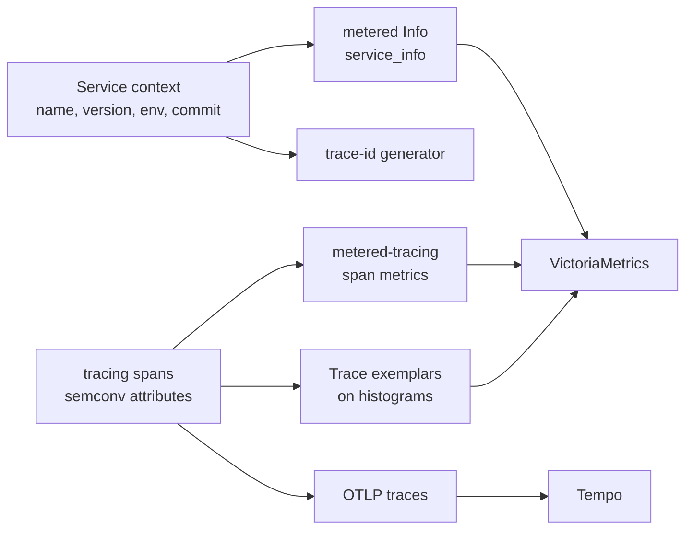

# Tracing Integration

`metered-tracing` turns [`tracing`](https://docs.rs/tracing) spans into
`metered` metrics. The core crate does not depend on tracing, OpenTelemetry,
or a service framework. The point is to measure once. Code that already
carries spans -- an `#[tracing::instrument]`-ed method, a span-opening
middleware -- gets counters and duration histograms derived from those spans.
There is no second instrumentation to write or keep in sync.

Declare one [`SpanMetric`] per *semantic* span, for example an RPC server, a
DB client, or a worker. Wire them into a [`TracingMetrics`] layer. Enable the
crate's `exemplar` feature to feed the ambient exemplar context of `metered`
from tracing spans. Any observation point can consume that context through the
`ThreadLocalExemplars` source (see [Exemplars](./exemplars.md)).

Service identity is intentionally not owned by this crate. A service framework
should expose service metadata (`service.name`, version, deployment environment,
commit, etc.) as a normal `Info` metric and/or shared registry labels.

## Semantic span metrics

Spans are not folded into one generic `span_*` family. Each [`SpanMetric`]:

- matches spans by name, for example `rpc.server`,
- records a `<name>_requests_total` counter and a `<name>_duration_seconds`
  histogram on close,
- labels both from the span's semantic fields, with a per-label default.

A `SpanMetric` is a cheap handle that you can clone. Hand one clone to the
layer, which records span closes. Place another clone in your metric view
under the semantic name it should carry on the wire. The result is
exporter-agnostic: register it with `metered-om` or another sink at the
exposition site.

```rust
use metered::entry::metric;
use metered::Registry;
use metered_om::OpenMetricsRegistryExt;
use metered_tracing::{SpanMetric, TracingMetrics};
use tracing_subscriber::prelude::*;

let rpc = SpanMetric::for_span("rpc.server")
    .help("RPC server calls")
    .label("rpc_method", "rpc.method")
    .label_or("rpc_status", "rpc.grpc.status_code", "OK")
    .build();

let layer = TracingMetrics::builder().recorder(rpc.clone()).build();
let subscriber = tracing_subscriber::registry().with(layer);

tracing::subscriber::with_default(subscriber, || {
    let span = tracing::info_span!(
        "rpc.server",
        rpc.method = "CreateOrder",
        rpc.grpc.status_code = "OK"
    );
    let _entered = span.enter();
});

let mut registry = Registry::with_prefix("my_service");
registry.register(metric("rpc_server").source(&rpc));

let text = registry.encode_to_string().unwrap();
assert!(text.contains("# TYPE my_service_rpc_server_duration_seconds histogram"));
assert!(text.contains(
    "my_service_rpc_server_requests_total{rpc_method=\"CreateOrder\",rpc_status=\"OK\"} 1"
));
```

Registering the `rpc` handle under `rpc_server` emits:

- `rpc_server_requests_total`
- `rpc_server_duration_seconds`

both labeled by the configured fields (`rpc_method`, `rpc_status`) read from the
span at close. Distinct span names feed distinct families, so the method lives in
a label, not the metric name.

A label reads the **final** field value at close, so you can declare a field up
front and record it later:

```rust
# use metered_tracing::SpanMetric;
# let _ = SpanMetric::for_span("rpc.server").label("rpc_status", "rpc.grpc.status_code").build();
let span = tracing::info_span!(
    "rpc.server",
    rpc.grpc.status_code = tracing::field::Empty
);
span.record("rpc.grpc.status_code", "INTERNAL");
```

Custom duration buckets are per span metric:

```rust
# use metered_tracing::SpanMetric;
let db = SpanMetric::for_span("db.query")
    .duration_buckets(metered::Buckets::fast_seconds())
    .label("db_operation", "db.operation")
    .build();
```

## Composing across crates

A span metric belongs to the component that **emits** the span, because only
that component knows the span's name and field names. The component therefore
*owns* the `SpanMetric` as a field. A `SpanMetric` is an `Arc`-backed handle,
so the component does two things with the one it owns. It mounts a clone in
its own metric view: this is the exposition side, where the metric belongs in
the tree. It hands a clone to the routing layer: this is the recording side.
The component implements [`SpanMetricsSource`] for the latter:

```rust
use metered::{MetricTreeView, MetricsView};
use metered_tracing::{SpanMetric, SpanMetricsSource, SpanRecorder, TracingMetrics};
use std::sync::Arc;

// In the RPC framework crate: the layer owns its span metric.
struct RpcLayer {
    server: SpanMetric,
}

impl RpcLayer {
    fn new() -> Self {
        RpcLayer {
            server: SpanMetric::for_span("rpc.server")
                .label("rpc_method", "rpc.method")
                .build(),
        }
    }
}

// Hand the routing layer the recorders this component contributes (recording
// side). `span_recorders` takes `self: &Arc<Self>` so a component can project
// durations from its own shared handle; an owned `SpanMetric` is itself a
// `SpanRecorder`.
impl SpanMetricsSource for RpcLayer {
    fn span_recorders(self: &Arc<Self>) -> Vec<Box<dyn SpanRecorder>> {
        vec![Box::new(self.server.clone())]
    }
}

// ...and mount the same handle where it belongs (exposition side). Under the
// `rpc` field in the app, the `server` segment yields `..._rpc_server_*`.
impl MetricsView for RpcLayer {
    fn metrics_view() -> MetricTreeView<'static, Self> {
        let mut view = MetricTreeView::new();
        view.register(metered::entry::metric("server").select(|layer: &RpcLayer| &layer.server));
        view
    }
}

// In the service binary: assemble the routing layer from each component's owned
// metrics. Components are shared as `Arc`s (the same handles exported through
// their views), and `.source` takes `&Arc<T>`. The layer only writes; each
// component exports its own metric in its own view, so nothing is flattened
// into a separate telemetry blob.
let rpc = Arc::new(RpcLayer::new());
let layer = TracingMetrics::builder().source(&rpc).build();
# let _ = layer;
```

The service's own `MetricTree` mounts each component, such as `rpc` and `db`,
under its field, so every span-derived metric sits with its owner. Adding a
subsystem is one more field plus one more `.source(&component)`. No top-level
code needs to know its span names or labels.

## Projecting durations from a component

A [`SpanMetric`] owns its families: it both counts and times. A component can
*already* own its duration metric as a plain
`Family<L, DynamicExponentialHistogram>` field, the very field its
`MetricsView` exposes for scraping. In that case you do not want a second,
separately owned copy of that histogram. [`SpanDurations::on`] adapts the span
to the family the component already owns. It records the open-to-close
duration, in seconds, on each matching span close.

The histogram backend is a generic parameter with the dynamic exponential
histogram as its default: `SpanDurations<C, L>` means
`SpanDurations<C, L, DynamicExponentialHistogram>`. When an alert contract
requires fixed `le` bounds, project to a `Family<L, BucketHistogram>` built
with your service-level objective buckets instead. The adapter accepts
any backend that implements [`ObserveSampled`].

The rule is **Arc the context, project to the metric**. The adapter holds an
`Arc` of the *containing component* plus a projection to the family inside it.
No `Arc` ever wraps an individual metric, so metrics stay plain struct fields.
The same component handle serves both sides: its view exports it, and the
recorder feeds it to the layer.

The typed label key comes from a `#[derive(SpanLabels)]` struct. The field
names are the OpenMetrics labels, and `#[span("otel.field")]` maps each to the
span field it reads at close. [`metered_info_span!`] opens the span with the
same field names, so there is no drift between what the span carries and what
keys the histogram.

```rust,no_run
use metered::{DynamicExponentialHistogram, Family, LabelSet};
use metered_tracing::{metered_info_span, SpanDurations, SpanLabels, TracingMetrics};
use std::sync::Arc;
use tracing_subscriber::prelude::*;

#[derive(Clone, PartialEq, Eq, Hash, LabelSet, SpanLabels)]
#[span(name = "db.query", help = "DB query duration")]
struct DbLabels {
    #[span("db.operation.name")]
    db_operation: String,
}

// The component owns the duration family as a plain field; no Arc wraps the
// metric. The same field is what `Db`'s MetricsView exposes for scraping.
struct Db {
    duration: Family<DbLabels, DynamicExponentialHistogram>,
}

let db = Arc::new(Db { duration: Family::default() });

// Arc the *component* (`&db`), project to the *metric* (`|db| &db.duration`).
let telemetry = TracingMetrics::builder()
    .recorder(SpanDurations::on(DbLabels::SPAN, &db, |db: &Db| &db.duration))
    .build();
let subscriber = tracing_subscriber::registry().with(telemetry);

tracing::subscriber::with_default(subscriber, || {
    metered_info_span!(DbLabels; db_operation = "insert".to_owned()).in_scope(|| {});
});
# let _ = db;
```

`SpanDurations` is the recorder a [`SpanMetricsSource`] component returns when its
metric is a bare family rather than a `SpanMetric`: `span_recorders` clones the
component `Arc` into one `SpanDurations::on(...)` per timed span.

The layer captures span fields **typed**: a `u64` span value never round-trips
through a string. The typed key conversion is fallible. A captured value that
does not convert to its declared label type skips the observation. The layer
counts it under `TracingMetrics::malformed_spans()`, a bounded counter keyed
by span name that you can mount in a metric view. The label never silently
defaults. A custom label type implements `FromFieldValue`, typically with a
parse of its text form.

[`SpanMetricsSource`]: https://docs.rs/metered-tracing/latest/metered_tracing/trait.SpanMetricsSource.html

## Exemplars

Enable `metered-tracing` with the `exemplar` feature (pulls in `metered`'s
`exemplar-context`). The layer sets the ambient exemplar from the fields of the
active span. The example below consumes it on a plain core histogram
observation. Prefer a **single** layer when you need both span metrics and
exemplars:

```toml
metered-tracing = { version = "0.10.0-rc.1", features = ["exemplar"] }
```

```rust
use metered::bucket_histogram::{ExemplarSource, ThreadLocalExemplars};
use metered::BucketHistogram;
use metered_tracing::{FieldExemplarProvider, TracingMetrics};
use tracing_subscriber::prelude::*;

let latency = BucketHistogram::default();
let provider = FieldExemplarProvider::new(["trace_id", "span_id"]);
let tracing_metrics = TracingMetrics::builder().build().with_exemplar_provider(provider);
let subscriber = tracing_subscriber::registry().with(tracing_metrics);

tracing::subscriber::with_default(subscriber, || {
    let span = tracing::info_span!(
        "http.request",
        trace_id = "4bf92f3577b34da6a3ce929d0e0e4736",
        span_id = "00f067aa0ba902b7"
    );
    let _entered = span.enter();

    // Inside the span, the ambient context carries its trace/span ids.
    let observed = 0.012;
    if let Some(mut exemplar) = ThreadLocalExemplars.exemplar() {
        exemplar.value = observed;
        latency.observe_with_exemplar(observed, exemplar);
    } else {
        latency.observe(observed);
    }
});
```

For exemplars only, with no span counters or histograms, use
`TracingExemplarLayer` or `TracingMetrics::exemplar_only(provider)`.

Exemplars are not distributed-tracing-specific. An exemplar is any label set
that points at a concrete observation, so `FieldExemplarProvider` lifts
*whatever* fields you name. Name `["trace_id", "span_id"]` to link to a trace.
Or name a purely local identifier like `["order_id"]` to jump from a latency
bucket straight to the exact entity behind it, with no trace system required.
Frameworks that own canonical trace context can implement [`ExemplarProvider`]
directly for custom mapping.

### Marking traces for retention

A histogram *adopts* an exemplar when the exemplar wins its sampling window
and becomes the visible bucket exemplar. The trace behind an adopted exemplar
is one a dashboard can jump to, so it is exactly the trace that tail-sampling
should keep. `on_exemplar_adopted` is that seam: the builder fires the hook
with each adopted exemplar, whose labels carry the trace id.

```rust,no_run
use metered_tracing::TracingMetrics;

let telemetry = TracingMetrics::builder()
    // ...add your span recorders with `.recorder(...)` / `.source(...)`...
    .on_exemplar_adopted(|exemplar| {
        // The exemplar won its bucket: mark its trace for retention so
        // tail-sampling keeps the trace behind this latency sample.
        if let Some((_, trace_id)) = exemplar.labels.iter().find(|(k, _)| k == "trace_id") {
            mark_for_retention(trace_id);
        }
    })
    .build();
# let _ = telemetry;
# fn mark_for_retention(_trace_id: &str) {}
```

When you later hand the built bundle an exemplar provider with
`with_exemplar_provider`, the bundle keeps the hook. You can register the hook
on the plain builder and still attach trace context afterwards.

## Fitting with service context

A service framework can keep the three observability planes aligned without
coupling them:



[`SpanMetric`]: https://docs.rs/metered-tracing/latest/metered_tracing/struct.SpanMetric.html
[`SpanDurations::on`]: https://docs.rs/metered-tracing/latest/metered_tracing/struct.SpanDurations.html#method.on
[`ObserveSampled`]: https://docs.rs/metered-tracing/latest/metered_tracing/trait.ObserveSampled.html
[`metered_info_span!`]: https://docs.rs/metered-tracing/latest/metered_tracing/macro.metered_info_span.html
[`TracingMetrics`]: https://docs.rs/metered-tracing/latest/metered_tracing/struct.TracingMetrics.html
[`ExemplarProvider`]: https://docs.rs/metered-tracing/latest/metered_tracing/trait.ExemplarProvider.html
