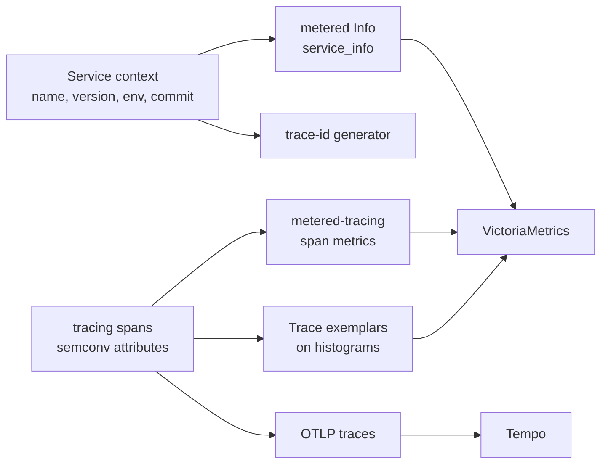

# Tracing Integration

`metered-tracing` turns [`tracing`](https://docs.rs/tracing) spans into
`metered` metrics without making the core crate depend on tracing,
OpenTelemetry, or a service framework.

Declare one [`SpanMetric`] per *semantic* span (RPC server, DB client, worker,
...) and wire them into a [`TracingMetrics`] layer. Enable the crate's
`exemplar` feature to feed metered's ambient exemplar context from tracing spans.
Legacy `Elapsed<ThreadLocalExemplars>` can consume that context when the
`legacy` feature is enabled.

Service identity is intentionally not owned by this crate. A service framework
should expose service metadata (`service.name`, version, deployment environment,
commit, etc.) as a normal `Info` metric and/or shared registry labels.

## Semantic Span Metrics

Spans are not folded into one generic `span_*` family. Each [`SpanMetric`]:

- matches spans by name (e.g. `rpc.server`),
- records a `<name>_requests_total` counter and a `<name>_duration_seconds`
  histogram on close,
- labels both from the span's semantic fields, with a per-label default.

A `SpanMetric` is a cheap clonable handle. Hand one clone to the layer (so span
closes are recorded) and place another in your metric view under the semantic
name it should carry on the wire. The result is exporter-agnostic: register it
with `metered-om` (or another sink) at the exposition site.

```rust
use metered::entry::metric;
use metered::Registry;
use metered_om::OpenMetricsRegistryExt;
use metered_tracing::{SpanMetric, TracingMetrics};
use tracing_subscriber::prelude::*;

let rpc = SpanMetric::for_span("rpc.server")
    .help("RPC server calls")
    .label("rpc_method", "rpc.method")
    .label_or("rpc_status", "rpc.grpc.status_code", "OK")
    .build();

let layer = TracingMetrics::builder().recorder(rpc.clone()).build();
let subscriber = tracing_subscriber::registry().with(layer);

tracing::subscriber::with_default(subscriber, || {
    let span = tracing::info_span!(
        "rpc.server",
        rpc.method = "CreateOrder",
        rpc.grpc.status_code = "OK"
    );
    let _entered = span.enter();
});

let mut registry = Registry::with_prefix("my_service");
registry.register(metric("rpc_server").source(&rpc));

let text = registry.encode_to_string().unwrap();
assert!(text.contains("# TYPE my_service_rpc_server_duration_seconds histogram"));
assert!(text.contains(
    "my_service_rpc_server_requests_total{rpc_method=\"CreateOrder\",rpc_status=\"OK\"} 1"
));
```

Registering the `rpc` handle under `rpc_server` emits:

- `rpc_server_requests_total`
- `rpc_server_duration_seconds`

both labeled by the configured fields (`rpc_method`, `rpc_status`) read from the
span at close. Distinct span names feed distinct families, so the method lives in
a label, not the metric name.

A label reads the **final** field value at close, so you can declare a field up
front and record it later:

```rust
# use metered_tracing::SpanMetric;
# let _ = SpanMetric::for_span("rpc.server").label("rpc_status", "rpc.grpc.status_code").build();
let span = tracing::info_span!(
    "rpc.server",
    rpc.grpc.status_code = tracing::field::Empty
);
span.record("rpc.grpc.status_code", "INTERNAL");
```

Custom duration buckets are per span metric:

```rust
# use metered_tracing::SpanMetric;
let db = SpanMetric::for_span("db.query")
    .duration_buckets(metered::Buckets::fast_seconds())
    .label("db_operation", "db.operation")
    .build();
```

## Composing across crates

A span metric belongs to the component that **emits** the span, because only it
knows the span's name and field names -- so the component *owns* the
`SpanMetric` as a field. Because a `SpanMetric` is an `Arc`-backed handle, the
component does two things with the one it owns: it mounts a clone in its own
metric view (exposition, where the metric belongs in the tree) and hands a clone
to the routing layer (recording). The component implements [`SpanMetricsSource`]
for the latter:

```rust
use metered::{MetricTreeView, MetricsView};
use metered_tracing::{SpanMetric, SpanMetricsSource, SpanRecorder, TracingMetrics};
use std::sync::Arc;

// In the RPC framework crate: the layer owns its span metric.
struct RpcLayer {
    server: SpanMetric,
}

impl RpcLayer {
    fn new() -> Self {
        RpcLayer {
            server: SpanMetric::for_span("rpc.server")
                .label("rpc_method", "rpc.method")
                .build(),
        }
    }
}

// Hand the routing layer the recorders this component contributes (recording
// side). `span_recorders` takes `self: &Arc<Self>` so a component can project
// durations from its own shared handle; an owned `SpanMetric` is itself a
// `SpanRecorder`.
impl SpanMetricsSource for RpcLayer {
    fn span_recorders(self: &Arc<Self>) -> Vec<Box<dyn SpanRecorder>> {
        vec![Box::new(self.server.clone())]
    }
}

// ...and mount the same handle where it belongs (exposition side). Under the
// `rpc` field in the app, the `server` segment yields `..._rpc_server_*`.
impl MetricsView for RpcLayer {
    fn metrics_view() -> MetricTreeView<'static, Self> {
        let mut view = MetricTreeView::new();
        view.register(metered::entry::metric("server").select(|layer: &RpcLayer| &layer.server));
        view
    }
}

// In the service binary: assemble the routing layer from each component's owned
// metrics. Components are shared as `Arc`s (the same handles exported through
// their views), and `.source` takes `&Arc<T>`. The layer only writes; each
// component exports its own metric in its own view, so nothing is flattened
// into a separate telemetry blob.
let rpc = Arc::new(RpcLayer::new());
let layer = TracingMetrics::builder().source(&rpc).build();
# let _ = layer;
```

The service's own `MetricTree` mounts each component (`rpc`, `db`, ...) under its
field, so every span-derived metric sits with its owner. Adding a subsystem is
one more field plus one more `.source(&component)`; no top-level code needs to
know its span names or labels.

## Projecting durations from a component

A [`SpanMetric`] owns its families (it both counts and times). When a component
*already* owns its duration metric as a plain
`Family<L, DynamicExponentialHistogram>` field -- the very field its
`MetricsView` exposes for scraping -- you do not want a second, separately-owned
copy of that histogram. [`SpanDurations::on`] adapts the span to the family
the component already owns, recording the open-to-close duration on each matching
span close.

The rule is **Arc the context, project to the metric**: the adapter holds an
`Arc` of the *containing component* plus a projection to the family inside it. No
`Arc` ever wraps an individual metric, so metrics stay plain struct fields and
the same component handle is both exported (through its view) and fed to the
layer (through the recorder).

The typed label key comes from a `#[derive(SpanLabels)]` struct: the field names
are the OpenMetrics labels, and `#[span("otel.field")]` maps each to the span
field it reads at close. [`metered_info_span!`] opens the span with the same
field names, so there is no drift between what the span carries and what the
histogram is keyed by.

```rust,no_run
use metered::{DynamicExponentialHistogram, Family, LabelSet};
use metered_tracing::{metered_info_span, SpanDurations, SpanLabels, TracingMetrics};
use std::sync::Arc;
use tracing_subscriber::prelude::*;

#[derive(Clone, PartialEq, Eq, Hash, LabelSet, SpanLabels)]
#[span(name = "db.query", help = "DB query duration")]
struct DbLabels {
    #[span("db.operation.name")]
    db_operation: String,
}

// The component owns the duration family as a plain field; no Arc wraps the
// metric. The same field is what `Db`'s MetricsView exposes for scraping.
struct Db {
    duration: Family<DbLabels, DynamicExponentialHistogram>,
}

let db = Arc::new(Db { duration: Family::default() });

// Arc the *component* (`&db`), project to the *metric* (`|db| &db.duration`).
let telemetry = TracingMetrics::builder()
    .recorder(SpanDurations::on(DbLabels::SPAN, &db, |db: &Db| &db.duration))
    .build();
let subscriber = tracing_subscriber::registry().with(telemetry);

tracing::subscriber::with_default(subscriber, || {
    metered_info_span!(DbLabels; db_operation = "insert".to_owned()).in_scope(|| {});
});
# let _ = db;
```

`SpanDurations` is the recorder a [`SpanMetricsSource`] component returns when its
metric is a bare family rather than a `SpanMetric`: `span_recorders` clones the
component `Arc` into one `SpanDurations::on(...)` per timed span.

Span fields are captured **typed** (a `u64` span value never round-trips
through a string), and the typed key conversion is fallible: a captured value
that does not convert to its declared label type skips the observation and is
counted under `TracingMetrics::malformed_spans()` -- a bounded counter keyed by
span name that you can mount in a metric view -- rather than silently
defaulting the label. A custom label type implements `FromFieldValue`
(typically by parsing its text form).

[`SpanMetricsSource`]: https://docs.rs/metered-tracing/latest/metered_tracing/trait.SpanMetricsSource.html

## Exemplars

Enable `metered-tracing` with the `exemplar` feature (pulls in `metered`'s
`exemplar-context`). The example below uses `Elapsed` to demonstrate ambient
exemplar consumption; that type lives in the `metered-semantic` crate.
Prefer a **single** layer when you need both span metrics and exemplars:

```toml
metered-tracing = { version = "0.10", features = ["exemplar"] }
```

```rust
use metered::Registry;
use metered::bucket_histogram::ThreadLocalExemplars;
use metered_semantic::Elapsed;
use metered_om::OpenMetricsRegistryExt;
use metered_tracing::{FieldExemplarProvider, TracingMetrics};
use tracing_subscriber::prelude::*;

let elapsed: Elapsed<ThreadLocalExemplars> = Elapsed::default();
let provider = FieldExemplarProvider::new(["trace_id", "span_id"]);
let tracing_metrics = TracingMetrics::builder().build().with_exemplar_provider(provider);
let subscriber = tracing_subscriber::registry().with(tracing_metrics);

tracing::subscriber::with_default(subscriber, || {
    let span = tracing::info_span!(
        "http.request",
        trace_id = "4bf92f3577b34da6a3ce929d0e0e4736",
        span_id = "00f067aa0ba902b7"
    );
    let _entered = span.enter();
    metered::measure!(&elapsed, {});
});
```

For exemplars only (no span counters/histograms), use `TracingExemplarLayer` or
`TracingMetrics::exemplar_only(provider)`.

Exemplars are not distributed-tracing-specific. An exemplar is any label set that
points at a concrete observation, so `FieldExemplarProvider` lifts *whatever*
fields you name -- `["trace_id", "span_id"]` to link to a trace, or a purely
local identifier like `["order_id"]` to jump from a latency bucket straight to
the exact entity behind it, no trace system required. Frameworks that own
canonical trace context can implement [`ExemplarProvider`] directly for custom
mapping.

### Marking traces for retention

When an exemplar is *adopted* by its histogram -- kept as the visible bucket
exemplar after winning its sampling window -- the trace behind it is one a
dashboard can jump to, so it is exactly the trace tail-sampling should keep.
`on_exemplar_adopted` is that seam: the builder fires the hook with each adopted
exemplar, whose labels carry the trace id.

```rust,no_run
use metered_tracing::TracingMetrics;

let telemetry = TracingMetrics::builder()
    // ...add your span recorders with `.recorder(...)` / `.source(...)`...
    .on_exemplar_adopted(|exemplar| {
        // The exemplar won its bucket: mark its trace for retention so
        // tail-sampling keeps the trace behind this latency sample.
        if let Some((_, trace_id)) = exemplar.labels.iter().find(|(k, _)| k == "trace_id") {
            mark_for_retention(trace_id);
        }
    })
    .build();
# let _ = telemetry;
# fn mark_for_retention(_trace_id: &str) {}
```

The hook is preserved when the built bundle is later handed an exemplar provider
with `with_exemplar_provider`, so you can register it on the plain builder and
still attach trace context afterwards.

## Fitting With Service Context

A service framework can keep the three observability planes aligned without
coupling them:



That leaves room for a future tracing-integration cleanup:

- replace fixed issuer enums with service-context configuration;
- normalize `RequestId` vs `TraceId` into one canonical trace identity story;
- use OpenTelemetry semantic conventions consistently for trace attributes,
  metric labels, and log fields;
- provide an [`ExemplarProvider`] backed by the cleaned-up trace context.

[`SpanMetric`]: https://docs.rs/metered-tracing/latest/metered_tracing/struct.SpanMetric.html
[`SpanDurations::on`]: https://docs.rs/metered-tracing/latest/metered_tracing/struct.SpanDurations.html#method.on
[`metered_info_span!`]: https://docs.rs/metered-tracing/latest/metered_tracing/macro.metered_info_span.html
[`TracingMetrics`]: https://docs.rs/metered-tracing/latest/metered_tracing/struct.TracingMetrics.html
[`ExemplarProvider`]: https://docs.rs/metered-tracing/latest/metered_tracing/trait.ExemplarProvider.html
